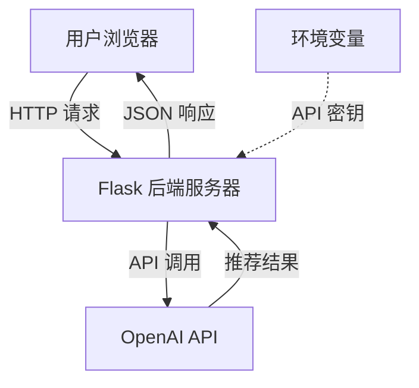

# 设计文档

## 概述

智能书籍推荐系统是一个轻量级的 Web 应用，采用前后端分离架构。前端使用纯 HTML/CSS/JavaScript 构建用户界面，后端使用 Python Flask 框架提供 RESTful API 服务。系统通过 OpenAI API 的 GPT 模型分析用户心情并生成个性化的书籍推荐。

## 架构

### 系统架构图



### 技术栈

**前端:**
- HTML5 - 页面结构
- CSS3 - 样式设计
- Vanilla JavaScript - 交互逻辑

**后端:**
- Python 3.8+
- Flask - Web 框架
- OpenAI Python SDK - API 集成
- python-dotenv - 环境变量管理

### 部署架构

- 开发环境：本地运行 Flask 开发服务器
- 生产环境：可部署到 Heroku、Railway 或其他 Python 托管平台

## 组件和接口

### 前端组件

#### 1. 主页面 (index.html)

**职责:**
- 展示心情输入界面
- 显示书籍推荐结果
- 处理用户交互和状态管理

**关键元素:**
- 心情输入表单（文本框 + 预设选项）
- 书籍类别选择器（可选，支持多选）
- 提交按钮
- 加载状态指示器
- 推荐结果展示区域（支持类别分组和筛选）
- 类别筛选器（用于过滤已显示的推荐结果）
- 错误提示区域

#### 2. 样式表 (style.css)

**职责:**
- 提供响应式布局
- 定义视觉样式和动画效果
- 确保跨设备兼容性

#### 3. 客户端脚本 (script.js)

**职责:**
- 处理表单提交
- 发送 AJAX 请求到后端
- 动态更新 DOM 显示推荐结果
- 管理加载和错误状态

**关键函数:**
```javascript
- submitMood() - 提交心情数据和可选的类别偏好
- displayRecommendations(data) - 渲染推荐结果（支持类别分组）
- filterByCategory(category) - 按类别筛选显示的推荐
- renderCategoryTags() - 渲染类别标签
- showLoading() - 显示加载状态
- showError(message) - 显示错误信息
```

### 后端组件

#### 1. Flask 应用 (app.py)

**职责:**
- 提供 HTTP 服务器
- 定义 API 路由
- 处理请求和响应
- 集成 OpenAI API

**API 端点:**

**GET /**
- 描述：返回主页面
- 响应：HTML 页面

**POST /api/recommend**
- 描述：接收心情输入和可选的类别偏好，返回书籍推荐
- 请求体：
```json
{
  "mood": "string",
  "categories": ["string"] // 可选，用户选择的类别列表
}
```
- 响应体（成功）：
```json
{
  "recommendations": [
    {
      "title": "书名",
      "author": "作者",
      "reason": "推荐理由",
      "category": "书籍类别",
      "subcategory": "子类别" // 可选
    }
  ]
}
```
- 响应体（失败）：
```json
{
  "error": "错误信息"
}
```

**GET /api/categories**
- 描述：获取所有可用的书籍类别列表
- 响应体：
```json
{
  "categories": [
    {
      "id": "literature",
      "name": "文学类",
      "subcategories": ["小说", "散文", "诗歌", "经典名著", "当代文学", "外国文学"]
    }
  ]
}
```

#### 2. OpenAI 集成模块

**职责:**
- 封装 OpenAI API 调用逻辑
- 构建提示词（prompt）
- 解析 API 响应
- 处理 API 错误

**关键函数:**
```python
- get_book_recommendations(mood: str, categories: list = None) -> list
- build_prompt(mood: str, categories: list = None) -> str
- parse_response(response: str) -> list
- get_available_categories() -> dict
```

#### 3. 配置管理

**职责:**
- 加载环境变量
- 管理 API 密钥
- 配置应用参数

**环境变量:**
- `OPENAI_API_KEY` - OpenAI API 密钥
- `FLASK_ENV` - 运行环境（development/production）
- `PORT` - 服务器端口（可选，默认 5000）

## 数据模型

### 请求模型

```python
class MoodRequest:
    mood: str                    # 用户心情描述，1-500 字符
    categories: List[str] = []   # 可选，用户选择的类别列表
```

### 推荐模型

```python
class BookRecommendation:
    title: str         # 书名
    author: str        # 作者
    reason: str        # 推荐理由
    category: str      # 书籍主类别
    subcategory: str   # 书籍子类别（可选）
```

### 类别模型

```python
class BookCategory:
    id: str                      # 类别唯一标识
    name: str                    # 类别显示名称
    subcategories: List[str]     # 子类别列表
```

### 响应模型

```python
class RecommendationResponse:
    recommendations: List[BookRecommendation]  # 推荐列表，3-5 本书

class CategoryResponse:
    categories: List[BookCategory]  # 所有可用类别
```

## 错误处理

### 错误类型和处理策略

1. **客户端验证错误**
   - 场景：用户未输入心情
   - 处理：前端显示提示，不发送请求

2. **网络错误**
   - 场景：无法连接到后端服务器
   - 处理：显示"网络连接失败，请检查网络"

3. **OpenAI API 错误**
   - 场景：API 密钥无效、配额不足、服务不可用
   - 处理：记录错误日志，返回友好错误信息给前端

4. **超时错误**
   - 场景：OpenAI API 响应超时
   - 处理：设置 30 秒超时，超时后返回错误

5. **服务器内部错误**
   - 场景：代码异常、解析失败
   - 处理：捕获异常，返回通用错误信息，记录详细日志

### 错误响应格式

所有错误响应使用统一格式：
```json
{
  "error": "用户友好的错误描述",
  "code": "ERROR_CODE"
}
```

## 测试策略

### 单元测试

**后端测试:**
- 测试 OpenAI API 集成函数
- 测试提示词构建逻辑
- 测试响应解析功能
- 使用 mock 模拟 OpenAI API 响应

**工具:** pytest

### 集成测试

- 测试完整的 API 端点
- 测试请求验证逻辑
- 测试错误处理流程

### 手动测试

**前端测试:**
- 测试不同心情输入的推荐结果
- 测试响应式布局在不同设备上的表现
- 测试加载状态和错误提示显示
- 测试用户交互流程

**测试场景:**
1. 正常流程：输入心情 → 获得推荐
2. 空输入：验证错误提示
3. 网络断开：验证错误处理
4. API 错误：验证错误提示
5. 不同心情类型：开心、悲伤、焦虑、平静等

## 安全考虑

1. **API 密钥保护**
   - 密钥存储在 `.env` 文件中
   - `.env` 文件添加到 `.gitignore`
   - 不在前端代码中暴露密钥

2. **输入验证**
   - 限制心情输入长度（最大 500 字符）
   - 防止 SQL 注入（虽然本系统不使用数据库）
   - 清理用户输入

3. **CORS 配置**
   - 开发环境允许跨域
   - 生产环境配置适当的 CORS 策略

4. **速率限制**
   - 考虑添加请求频率限制防止滥用
   - 可使用 Flask-Limiter 扩展

## 性能优化

1. **响应时间优化**
   - 使用流式响应（如果 OpenAI API 支持）
   - 设置合理的超时时间

2. **缓存策略**
   - 静态资源（CSS/JS）使用浏览器缓存
   - 考虑缓存常见心情的推荐结果（可选）

3. **前端优化**
   - 最小化 HTTP 请求
   - 使用 CSS 动画而非 JavaScript 动画
   - 延迟加载非关键资源

## 书籍类别功能设计

### 类别数据结构

系统支持 12 个主要类别，每个类别包含多个子类别：

```python
BOOK_CATEGORIES = {
    "literature": {
        "name": "文学类",
        "subcategories": ["小说", "散文", "诗歌", "经典名著", "当代文学", "外国文学"]
    },
    "social_science": {
        "name": "社科类",
        "subcategories": ["历史", "哲学", "心理学", "社会学", "政治", "经济学"]
    },
    "technology": {
        "name": "科技类",
        "subcategories": ["科普", "互联网", "人工智能", "编程技术", "科学史"]
    },
    "business": {
        "name": "商业类",
        "subcategories": ["管理", "创业", "营销", "投资理财", "职场"]
    },
    "lifestyle": {
        "name": "生活类",
        "subcategories": ["健康养生", "美食", "旅行", "家居", "时尚"]
    },
    "personal_growth": {
        "name": "成长类",
        "subcategories": ["自我提升", "励志", "学习方法", "时间管理", "沟通技巧"]
    },
    "arts": {
        "name": "艺术类",
        "subcategories": ["绘画", "音乐", "摄影", "设计", "电影"]
    },
    "children": {
        "name": "儿童类",
        "subcategories": ["绘本", "儿童文学", "科普读物", "教育"]
    },
    "comics": {
        "name": "漫画类",
        "subcategories": ["国漫", "日漫", "欧美漫画"]
    },
    "mystery": {
        "name": "悬疑推理",
        "subcategories": ["推理小说", "悬疑小说", "犯罪小说"]
    },
    "scifi_fantasy": {
        "name": "科幻奇幻",
        "subcategories": ["科幻小说", "奇幻小说", "玄幻小说"]
    },
    "romance": {
        "name": "言情类",
        "subcategories": ["现代言情", "古代言情", "都市情感"]
    }
}
```

### 类别选择交互设计

**前端实现方案：**

1. **类别选择器组件**
   - 使用下拉菜单或标签云形式展示类别
   - 支持多选（使用复选框或标签点击）
   - 可折叠/展开，不占用过多空间
   - 默认状态为折叠，显示"选择感兴趣的类别（可选）"

2. **类别筛选器组件**
   - 在推荐结果上方显示
   - 显示所有出现在推荐结果中的类别
   - 点击类别标签进行筛选
   - 支持"全部"选项清除筛选

### Prompt 构建策略

当用户选择类别时，prompt 需要包含类别偏好：

```python
def build_prompt(mood: str, categories: list = None) -> str:
    base_prompt = f"用户当前的心情是：{mood}"

    if categories:
        category_names = [BOOK_CATEGORIES[cat]["name"] for cat in categories]
        category_prompt = f"\n用户偏好的书籍类别：{', '.join(category_names)}"
        base_prompt += category_prompt

    # 要求 GPT 在响应中包含类别信息
    format_instruction = """
    请以 JSON 格式返回，每本书必须包含 category 和 subcategory 字段：
    [
      {
        "title": "书名",
        "author": "作者",
        "reason": "推荐理由",
        "category": "主类别",
        "subcategory": "子类别"
      }
    ]
    """

    return base_prompt + format_instruction
```

### 前端展示策略

**方案 1：类别分组展示（默认）**
- 按类别将推荐结果分组
- 每个分组显示类别标签
- 适合未指定类别或推荐结果涵盖多个类别的情况

**方案 2：列表展示 + 类别标签**
- 推荐结果以列表形式展示
- 每本书显示类别标签（badge）
- 适合指定了特定类别的情况

**实现建议：**
- 当推荐结果包含 3 个或以上不同类别时，使用分组展示
- 当推荐结果类别较集中时，使用列表展示

## 扩展性考虑

未来可能的扩展方向：

1. **用户系统**
   - 用户注册和登录
   - 保存推荐历史
   - 个性化推荐
   - 记住用户的类别偏好

2. **数据持久化**
   - 添加数据库存储推荐记录
   - 分析用户偏好
   - 统计热门类别

3. **更多推荐维度**
   - 根据阅读历史推荐
   - 结合时间、天气等因素
   - 多语言支持
   - 类别组合推荐（跨类别）

4. **社交功能**
   - 分享推荐结果
   - 用户评价和反馈
   - 类别热度排行
